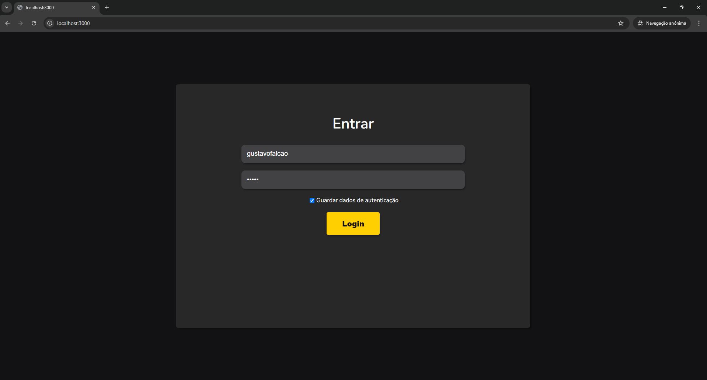
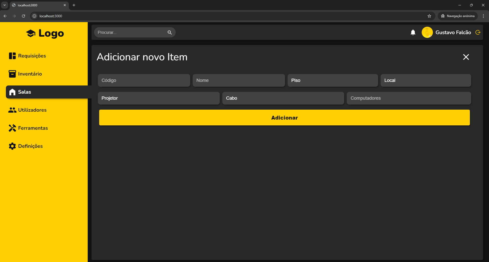

# WebSchool
* React
* Next
* Firebase
* Yarn

## Features
- [x] Request Inventory
  - [ ] QR Code Feature
- [x] Inventory Manager
- [x] Class Room Manager
- [x] Users Manager
- [x] Archive Task
- [x] Delete Task
- [ ] Tools Manager
- [ ] Settings App
- [ ] Electron Build

## Exec
### Install
```
  yarn install
```
### Run Dev
```
  yarn dev
```
### Build
```
  yarn build
```
### Run Built
```
  yarn start
```

## Screenshots




## Deploy OS Tested
- [x] Ubuntu Linux
- [ ] Arch Linux
- [ ] Windows
- [ ] MacOS

## Deploy
#### Ubuntu
  - Clone this project in /opt
```
  sudo nano /etc/systemd/system/webschool.service
```
#### past this:
```
  [Unit]
  Description=WebSchool App Service
  After=network.target
  
  [Service]
  ExecStart=/usr/bin/node /opt/webschool/pages/index.js
  WorkingDirectory=/opt/webschool
  Restart=always
  User=root
  Environment=NODE_ENV=production
  
  [Install]
  WantedBy=multi-user.target
```
